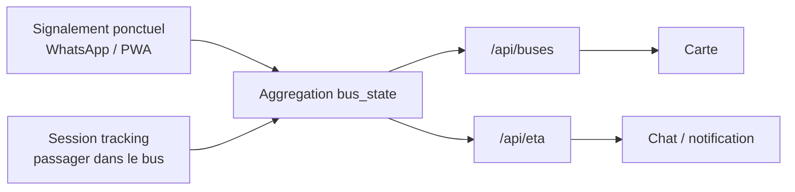

# Brainstorm Xetu - carte, tracking, streaming et IA

Date de consolidation : 2026-06-25  
Repo mobile : `C:\Users\DELL\Desktop\xetu-mobile`  
Repo backend / source metier : `C:\Users\DELL\Desktop\whatsapp-agent`

Ce document consolide les notes de brainstorming depuis le debut de la discussion : UI, carte, source de verite, tracking passagers, streaming GPS, ETA, IA et contraintes d'architecture. Il ne valide pas encore une implementation. Il sert de trace pour ne pas perdre le contexte.

## Captures et textes sources

### Captures utilisateur

- Mauvaises lignes affichees dans la modale d'abonnement : `C:\Users\DELL\AppData\Local\Temp\codex-clipboard-0de813c7-bf83-4c0c-b33c-0348a32e7136.png`
- Vraies lignes cartographiees attendues : `C:\Users\DELL\AppData\Local\Temp\codex-clipboard-e3ea15dc-b791-45da-adf4-7bb5deac271c.png`
- Bottom navigation actuelle, manque d'espace en bas : `C:\Users\DELL\AppData\Local\Temp\codex-clipboard-5395bd2b-8833-4341-923c-3fdba74351d8.png`
- Inspiration bottom navigation flottante avec bouton central : `C:\Users\DELL\AppData\Local\Temp\codex-clipboard-dcbc4f79-e4e7-4422-90db-ac01cf0dad74.png`
- Theme light incomplet : `C:\Users\DELL\AppData\Local\Temp\codex-clipboard-23663838-2cb8-4d75-aea9-a35b5282f849.png`
- Guideline grille / safe areas iOS et Android : `C:\Users\DELL\AppData\Local\Temp\codex-clipboard-26155a62-a381-41ad-8023-1c87e3e0ceae.png`

### Textes joints

- Recherche direction produit, IA, Google Maps, Valhalla/OSRM : `C:\Users\DELL\.codex\attachments\12afbeb1-ce8b-426f-bf24-d9540ee3d6a0\pasted-text.txt`
- Confrontation architecture tracking avec le code backend existant : `C:\Users\DELL\.codex\attachments\97274362-a634-4709-ba53-b15c31825e79\pasted-text.txt`
- Convergence ingestions separees vers une seule verite agregee + seam natif casse : `C:\Users\DELL\.codex\attachments\7e1a1967-e64f-4d9f-91d6-ef38692ffc11\pasted-text.txt`
- Ajouts critiques produit : incitation, cold-start, privacy/CDP, batterie/data, abus, observabilite : `C:\Users\DELL\.codex\attachments\6612c125-1450-4f52-9e67-02420d8ffc33\pasted-text.txt`
- Script propose pour generer les temps depuis `geometry_aller` / `geometry_retour` : `C:\Users\DELL\.codex\attachments\89e30369-eae9-4497-bfac-cc178057450e\pasted-text.txt`

## Notes UI a conserver

### Lignes bus

Constat utilisateur : la modale "S'abonner a une ligne" affiche des lignes non cartographiees comme `15`, `26`, `46`, `57`, `DDD`, `Tata`, `C3`, `C4`, `BRT`, `E1`, `83`, `77`.

Source de verite MVP confirmee : `Dashboard/data/xetu_mvp.json` dans `C:\Users\DELL\Desktop\whatsapp-agent`.

Lignes reellement cartographiees MVP :

```text
1, 4, 6, 7, 8, 9, 10, 13, 23, 232
```

Decision de direction : les listes UI qui concernent les lignes cartographiees doivent venir de cette source, pas d'une liste marketing ou ancienne.

Nuance importante verifiee dans le backend :

- `C:\Users\DELL\Desktop\whatsapp-agent\config\settings.py` charge `VALID_LINES` depuis le JSON MVP.
- Le fallback backend contient deja seulement les 10 lignes MVP : `1, 4, 6, 7, 8, 9, 10, 13, 23, 232`.
- Donc la divergence observee dans la modale est a traiter comme un probleme frontend/UI, pas comme une correction backend.

### Bottom navigation

Constats :

- Il manque un vrai espace bas / safe area sous la navigation.
- Le design cible est une bottom nav flottante, arrondie, avec un bouton central sureleve pour l'action principale `Signaler`.
- Le bouton central doit rester orange dans l'identite actuelle de l'app, meme si l'image d'inspiration utilise violet.
- La barre doit respecter les zones systeme Android/iOS et ne pas coller au bord.

Direction UX :

- `Signaler` reste l'action principale.
- La nav doit etre compacte, lisible, et stable sur petit ecran Android.
- L'inspiration est la forme et la hierarchie, pas une copie exacte du theme.

### Theme light

Constat : la version light est incomplete. Certaines surfaces passent en clair, mais l'ecran garde une structure sombre ou hybride.

Direction :

- Revoir le theme via des tokens globaux, pas composant par composant.
- Verifier fond d'ecran, cards, inputs, texte secondaire, boutons, nav, status bar et cartes.
- Ne pas corriger seulement le symptome visuel de la capture.

### Grille et safe areas

Regle a noter :

- Marges laterales : 16 px.
- Gouttieres : 16 px.
- Respect status bar, app bar, bottom nav bar, Android navigation et iOS home indicator.
- Les composants fixes en bas doivent integrer safe-area + padding visuel.

## Source de verite

Decision utilisateur : le MVP JSON est la source de verite.

Fichier :

```text
C:\Users\DELL\Desktop\whatsapp-agent\Dashboard\data\xetu_mvp.json
```

Constats verifies pendant l'investigation :

- Lignes MVP : `1, 4, 6, 7, 8, 9, 10, 13, 23, 232`.
- Arrets aller : `378`.
- Arrets retour : `390`.
- Total arrets : `768`.
- Points `geometry_aller` : `5880`.
- `travel_time_to_next_sec` rempli : `0 %`.

Implication : la carte et les coordonnees existent deja. Le trou principal cote ETA est le temps segment par segment.

Nuance importante ajoutee apres analyse :

- Les lignes ont des traces dediees `geometry_aller` et `geometry_retour`.
- En comparant les arrets a la bonne geometrie par sens, chaque arret se projette exactement sur sa trace et l'ordre est monotone.
- Donc la geometrie Dem Dikk est assez propre pour devenir la source primaire des distances entre arrets.
- Un routeur voiture OSRM/osmnx peut inventer un chemin qui ne correspond pas a l'itineraire Dem Dikk ; les flags `detour` de l'ancienne approche decrivent ce probleme de routeur, pas un detour reel du bus.

## Carte : choix recommande

Question initiale : quelle carte choisir pour une app de tracking bus avec des passagers dans les bus ?

Recommandation actuelle :

- Garder Leaflet/PWA pour le MVP, car l'app mobile actuelle est un shell Expo qui charge la PWA.
- Ne pas passer a `react-native-maps` maintenant, sauf decision de reecrire une partie native de l'interface.
- Envisager MapLibre GL JS plus tard si les couches live, animations et volumes deviennent trop limites pour Leaflet.

Pourquoi :

- Le probleme prioritaire n'est pas le moteur de rendu de carte.
- Le probleme prioritaire est la chaine de donnees : geoloc app -> backend -> agregation -> ETA -> rendu.
- Changer de carte avant d'avoir une verite live agregee risque de deplacer le cout sans ameliorer la valeur utilisateur.

## Expo, WebView et PWA

Constat d'architecture mobile :

- `C:\Users\DELL\Desktop\xetu-mobile\App.tsx` charge la PWA via `react-native-webview`.
- Expo n'est pas "juste un navigateur" : il peut fournir des capacites natives.
- Mais dans l'etat actuel, l'UI et la logique produit restent dans la PWA.
- Le shell Expo expose un pont natif `window.XetuNative.requestLocation(requestId)`.
- `geolocationEnabled={false}` est configure dans la WebView.

Interpretation :

- Ce n'est pas pire que Capacitor par nature.
- Le risque vient du fait que le pont natif existe mais que la PWA ne l'utilise pas encore.
- Tant que la PWA appelle `navigator.geolocation` directement, la geoloc peut etre cassee dans le shell.

## Seam app -> backend

Constat verifie :

- Grep dans `Dashboard/` pour `XetuNative`, `ReactNativeWebView`, `locationResult`, `requestLocation`, `watchPosition`, `sendTrackingUpdate`, `tracking/update` : rien cote PWA.
- `Dashboard/js/geoloc.js` recupere une position localement mais ne POST pas vers le backend.
- `Dashboard/js/signal.js` utilise `navigator.geolocation.getCurrentPosition`.
- Le shell Expo a pourtant deja un pont natif geoloc.

Conclusion : le seam est casse. Le pont natif et l'endpoint backend existent, mais ne sont relies par aucun appelant PWA.

Phase 0 recommandee avant toute grosse machine streaming :

```text
PWA bouton "Je vois le bus"
-> appelle XetuNative.requestLocation()
-> recoit locationResult
-> POST /tracking/update
-> backend record le signalement GPS
-> /api/buses reflete le bus
-> la carte se met a jour
```

But : prouver le tuyau complet avec un ping unique avant de construire le streaming.

## Tracking : clarification produit

Definition utilisateur : "tracking" signifie que les gens qui sont dans le bus partagent leur GPS, pas seulement qu'un utilisateur signale avoir vu un bus.

Donc il y a deux besoins differents :

- Signalement ponctuel : "j'ai vu le bus ici".
- Session de tracking : "je suis dans le bus, mon GPS envoie des pings pendant le trajet".

Le code backend actuel est principalement une machine a signalements, pas une machine a sessions.

## Backend actuel

Fichiers inspectes :

- `C:\Users\DELL\Desktop\whatsapp-agent\api\tracking.py`
- `C:\Users\DELL\Desktop\whatsapp-agent\skills\signalement.py`
- `C:\Users\DELL\Desktop\whatsapp-agent\db\queries.py`
- `C:\Users\DELL\Desktop\whatsapp-agent\api\buses.py`
- `C:\Users\DELL\Desktop\whatsapp-agent\core\network.py`
- `C:\Users\DELL\Desktop\whatsapp-agent\services\websocket.py`

Constats :

- `/tracking/update` existe deja.
- Il accepte `phone`, `lat`, `lon`, `ligne?`.
- Il anti-spam par phone avec une fenetre d'environ 30 s.
- Il rapproche le ping d'un arret, puis appelle `record_signalement`.
- Il ne conserve pas une trajectoire continue.
- Il ne maintient pas vitesse, cap, session, progression sur trace ou cluster multi-passagers.
- `/api/buses` reduit aujourd'hui les signalements a une entree recente par ligne.
- L'animation actuelle est donc plus proche d'une estimation/dead-reckoning que d'un vrai live streaming.

Point important :

`record_signalement` est le chokepoint anti-fraude existant. La future architecture doit le respecter ou le prolonger, pas le contourner sans decision.

## Architecture recommandee

Convergence actuelle : deux ingestions, une seule verite agregee.



### Option A : faire evoluer `/tracking/update`

Pour :

- Un seul endpoint.
- Moins de surface API.

Contre :

- Melange signalement ponctuel et streaming continu.
- Anti-spam, TTL et semantique deviennent confus.
- Risque de detruire l'existant WhatsApp/Telegram.

### Option B : stack separee completement

Pour :

- Conceptuellement propre pour le streaming.
- Tables dediees.

Contre :

- Cree deux sources concurrentes pour "ou est le bus".
- Il faut ensuite decider laquelle gagne.

### Option C recommandee : ingestions separees, agregation unique

Pour :

- `/tracking/update` reste pour le sparse / WhatsApp / signalement.
- Une ingestion session continue est ajoutee pour les passagers.
- Les deux alimentent `bus_state`, seule verite exposee.
- `/api/buses` et `/api/eta` deviennent des vues derivees.

Contre :

- Demande un vrai design de schema et d'agregation.
- Necessite de trancher l'identite (`device_id` vs `phone`) et le stockage pings.

## Tables cible a discuter

Proposition de design, non implementee :

```text
tracking_sessions
- id
- device_id ou phone
- ligne declaree
- direction optionnelle
- started_at
- last_ping_at
- status: active | stopped | expired
- plausibility_score

tracking_pings
- session_id
- lat
- lon
- accuracy
- speed
- heading
- timestamp
- matched_seg_idx
- progress
- on_route

bus_state
- ligne
- vehicle_id
- lat
- lon
- seg_from
- seg_to
- progress
- direction
- freshness_sec
- contributors
- confidence
- updated_at
```

Regle : `bus_state` ne doit jamais exposer l'identite des passagers.

## Map-matching

Ne pas confondre deux usages :

- Pour les pings live : projeter le point GPS sur notre propre trace `geometry_aller` / `geometry_retour`.
- Pour les temps entre arrets : utiliser la distance sur `geometry_aller` / `geometry_retour` comme source primaire, car Dem Dikk suit des itineraires fixes.

Pour le MVP live, si la ligne est declaree par l'utilisateur, on peut faire un map-matching in-process :

```text
ping GPS
-> ligne declaree
-> nearest segment sur geometry_aller ou geometry_retour
-> distance au trace
-> seg_idx + progress
-> rejet si trop loin / incoherent
```

Valhalla/OSRM n'est pas obligatoire pour recaler chaque ping sur notre trace. Il ne doit pas etre source primaire pour les temps Dem Dikk urbains, car le routage voiture point-a-point peut diverger de l'itineraire reel. Il reste utile comme validation, diagnostic ou fallback si une geometrie manque.

## Modele des temps entre arrets

Decision structurelle : la trace Dem Dikk est autoritaire.

Ancien modele ecarte :

```text
arret A -> arret B
-> routeur voiture OSM/OSRM/osmnx
-> temps free-flow
```

Probleme : le routeur calcule le chemin voiture entre deux points, pas la ligne Dem Dikk. Les flags `detour` ne disent pas que le bus fait un detour ; ils disent que le routeur a choisi un chemin different de la ligne.

Modele recommande :

```text
arret A -> arret B
-> projection sur geometry_aller ou geometry_retour
-> distance_sur_trace_m = abscisse(B) - abscisse(A)
-> temps(tranche) = distance_sur_trace_m / vitesse_bus(tranche) + dwell(tranche)
```

Format de sortie recommande :

```text
travel_time_to_next_sec : nombre scalaire, compatible backend actuel, valeur de la tranche 09-16
travel_time_profiles    : profils horaires en secondes
travel_time_meta        : constantes, source, disclaimer, date de generation
tt_flags                : anomalies, par exemple short/winding/long/osm_div
```

Constantes de depart proposees, a calibrer avec des observations terrain :

| Tranche | Vitesse bus en mouvement | Dwell par arret |
|---|---:|---:|
| 06-09 | 15 km/h | 25 s |
| 09-16 | 22 km/h | 18 s |
| 16-20 | 13 km/h | 25 s |

Regles :

- `travel_time_to_next_sec` reste scalaire pour ne pas casser `api/buses.py`.
- Le scalaire MVP = tranche `09-16`, une "journee type".
- Les profils horaires restent estimes, pas mesures.
- Les vraies vitesses doivent remplacer ces constantes quand les pings de streaming existent.
- Dry-run obligatoire avant tout `--apply` sur le JSON canonique.

## ETA et confiance

La valeur produit n'est pas "voir un point bouger". La vraie valeur est :

> Quand est-ce que MON bus arrive a MON arret, et a quel point je peux y croire ?

ETA recommande :

```text
temps restant sur segment courant
+ somme travel_time_to_next_sec des segments aval
= ETA avec fourchette
```

Niveau de confiance :

- `contributors` : nombre de passagers concordants.
- `freshness_sec` : age du dernier ping.
- `on_route` : distance au trace.
- `concordance` : les pings racontent-ils la meme trajectoire ?
- `source` : session live mesuree ou signalement estime.

Regle de reconciliation :

```text
si session live fraiche existe
  utiliser position mesuree agregee
sinon
  fallback signalement actuel + estimation
```

## Incitation et cold-start

Risque produit majeur : le streaming passager ne demarre pas tout seul.

Si personne n'active "Je suis dans le bus", il n'y a pas de live. Et s'il n'y a pas de live, l'utilisateur ne voit pas encore assez de valeur pour contribuer. C'est le probleme classique de cold-start du crowdsourcing.

Brique existante verifiee :

- `C:\Users\DELL\Desktop\whatsapp-agent\api\leaderboard.py` expose deja `/api/leaderboard`.
- Le leaderboard score aujourd'hui `nb_signalements` et `fiabilite_score`.
- Il gere deja des badges de type `Nouveau`, `Regulier`, `Expert`, `Legende`.

Direction :

- Etendre la gamification aux sessions de tracking, pas seulement aux signalements ponctuels.
- Recompenser les trajets ou minutes utiles contribuees en mode bus.
- Ne pas encourager le spam GPS : score base sur contribution validee, concordance, fraicheur et utilite.
- Demarrer par un pilote sur 1 ou 2 lignes, pas sur tout Dakar.

Questions a trancher :

- Qui seed les premieres sessions : chauffeurs, ambassadeurs, utilisateurs recrutes, pilote paye ?
- Quelle recompense est credible : statut, badges, avantage service, reconnaissance communautaire ?
- Comment expliquer honnetement le cout batterie/data avant l'opt-in ?

## Privacy, consentement et retention

Le streaming GPS continu est plus sensible qu'un signalement ponctuel. C'est une donnee de localisation continue liee a une personne ou un appareil.

Contraintes a traiter avant implementation :

- Consentement explicite au moment d'activer "Je suis dans le bus".
- Finalite claire : ameliorer l'ETA et l'etat live des bus, pas suivre les passagers.
- Retention courte des pings bruts.
- Suppression ou anonymisation des pings bruts apres agregation.
- Affichage public uniquement d'un bus agrege, jamais d'un passager.
- Politique de confidentialite compatible App Store / Play Store si l'app mobile collecte la localisation.
- Verification juridique/produit CDP avant collecte continue a grande echelle.

Note de conformite, a confirmer par conseil juridique :

- La Loi senegalaise n° 2008-12 encadre la collecte, le traitement, la transmission, le stockage et l'usage des donnees personnelles.
- La CDP est l'autorite de reference au Senegal pour la protection des donnees personnelles.
- Le traitement legitime repose notamment sur le consentement de la personne concernee ou une autre base prevue par la loi.

Sources consultees :

- Loi n° 2008-12 : `https://www.afapdp.org/wp-content/uploads/2018/05/Senegal-texte-de-loi-2008.pdf`
- Presentation CDP : `https://www.cdp.sn/commission/presentation`
- Synthese pratique : `https://africanlegalfactory.com/2023/05/11/comprendre-protection-donnees-personnelles-senegal/`

## Batterie, data et ping adaptatif

Risque produit : meme si le tracking marche techniquement, personne ne le gardera actif s'il vide la batterie ou consomme trop de data.

Le ping `15-30 s` doit etre une base, pas une frequence rigide.

Direction :

- Ping plus frequent quand le bus bouge.
- Ping plus lent si le bus est immobile ou proche d'un arret.
- Stop automatique si l'utilisateur sort du mode bus, si la session devient incoherente ou si une limite de duree est atteinte.
- Plafond de duree et de volume par session.
- UI d'opt-in honnete : "partage actif pendant le trajet, arret automatique".

Exemple de politique adaptative a discuter :

```text
en mouvement stable: ping toutes les 15-20 s
immobile / attente longue: ping toutes les 45-60 s
precision faible: attendre meilleur signal ou baisser confiance
session > 90 min: expiration automatique
```

## Observabilite et metriques de succes

Le pivot streaming doit etre mesure. Sinon on ne saura pas si le live ameliore vraiment l'app.

KPIs a suivre :

- Couverture live : pourcentage de lignes avec au moins un bus live frais.
- Couverture par ligne et par tranche horaire.
- Fraicheur mediane des positions.
- Nombre de contributeurs actifs par ligne.
- Precision ETA : ETA prevu vs arrivee observee.
- Taux de positions rejetees par map-matching.
- Taux de sessions abandonnees.
- Taux de fausses positions ou clusters incoherents.

Principe UX :

- La confiance affichee doit etre reliee a ces metriques.
- Un ETA faible confiance doit etre affiche comme tel, pas maquille.

## Empty-state zero contributeur

Au lancement, beaucoup de lignes auront zero streamer. C'est l'etat normal, pas une erreur.

La carte et le chat doivent prevoir cet etat :

- "Pas de position live pour cette ligne."
- "Derniere estimation basee sur un signalement."
- "Aide la communaute si tu es dans le bus."
- Ne pas afficher un bus anime comme s'il etait live si la source est estimee.

Objectif : rester utile sans mentir.

## Temps reel client

Constat actuel :

- La PWA poll `/api/buses` environ toutes les 30 s.
- Le backend possede deja une brique WebSocket, mais elle sert surtout chat/report dans l'etat inspecte.

Decision a trancher plus tard :

- Polling `/api/buses` pour le MVP simple.
- WebSocket pour pousser `bus_state` quand le volume live rend le polling trop lent ou trop couteux.

Direction :

- Ne pas introduire deux verites cote client.
- La carte doit consommer le meme etat agrege, que l'acheminement soit polling ou WebSocket.

## Abus, auth et faux bus

Risque : un endpoint de tracking qui accepte simplement `phone` ou `device_id` dans le body peut etre abuse par un script pour fabriquer de faux bus.

Mesures a prevoir :

- Token de session signe au demarrage de `tracking_sessions`.
- Rate-limit serveur par session, device et IP.
- Rejet des pings trop frequents.
- Rejet des points trop loin du trace.
- Rejet des vitesses impossibles ou des sauts incoherents.
- Score de confiance bas pour source unique non corroborree.
- Concordance multi-contributeurs comme defense produit, mais pas comme seule defense technique.

Point important : `device_id` anonyme est meilleur pour la privacy, mais plus faible qu'un `phone` contre la fraude. Le design anti-abus doit compenser.

## Cycle de vie vehicle_id et direction

Le futur `vehicle_id` n'est pas juste un champ. Il decrit un cluster vivant.

Questions a specifier avant code :

- Naissance : a partir de combien de pings/session cree-t-on un vehicle ?
- Persistance : comment rattacher un nouveau ping au meme vehicle ?
- Separation : comment distinguer deux bus proches sur la meme ligne ?
- Mort : quand supprimer un vehicle si tous les passagers descendent ?
- Direction : comment trancher aller/retour avec une sequence de pings + heading, pas avec un point isole ?

Direction :

- Un point GPS seul peut etre ambigu.
- La direction doit venir de la progression sur la trace dans le temps.
- Le vehicle doit mourir ou passer en "stale" quand sa fraicheur depasse le seuil.

## OpenStreetMap, Valhalla et OSRM

Position actuelle :

- Ne pas utiliser Google Maps/Gemini comme source persistante de dataset.
- Ne pas utiliser OSRM/osmnx point-a-point comme source primaire des temps Dem Dikk urbains.
- Utiliser `geometry_aller` / `geometry_retour` comme source primaire des distances arret -> arret.
- Garder OSM + Valhalla/OSRM/osmnx comme validation, diagnostic ou fallback, pas comme autorite.

Pipeline propose :

```text
xetu_mvp.json
-> extraire paires d'arrets consecutifs aller + retour
-> mesurer distance_sur_trace_m sur geometry_aller / geometry_retour
-> appliquer vitesse_bus(tranche) + dwell(tranche)
-> produire travel_time_to_next_sec scalaire + travel_time_profiles
-> generer un rapport dry-run avant ecriture canonique
```

Tranches horaires MVP pour les lignes urbaines Dem Dikk :

```text
06:00-09:00
09:00-16:00
16:00-20:00
```

Ne pas generer `20-23` ni `23-06` pour les lignes urbaines MVP. Les lignes classiques Dem Dikk sont a traiter comme un service `06h-20h` tant qu'un horaire officiel ligne par ligne ne dit pas autre chose.

Sources et prudence :

- Le site officiel Dem Dikk expose les lignes et itineraires urbains, mais pas un horaire detaille clair par ligne dans la page consultee : `https://demdikk.sn/reseau-urbain-dakar/`
- Une source transport locale indique que les lignes classiques fonctionnent de `6h a 20h`; les navettes express AIBD sont une exception separee : `https://www.au-senegal.com/liaisons-vers-l-aeroport-les-navettes-dem-dikk-vous-accompagnent,14953.html?lang=fr`
- Moovit renvoie aux horaires a jour dans son app, sans donner une autorite canonique exploitable dans notre dataset.

Regle produit :

```text
apres 20h sur les lignes urbaines MVP
-> ne pas afficher un ETA normal
-> afficher "Service probablement termine pour aujourd'hui. Reprise estimee demain vers 06h."
```

Trafic approximatif sans historique :

- Commencer avec des coefficients par tranche horaire.
- Puis remplacer progressivement par historique observe depuis les sessions.
- Ne pas vendre la precision : afficher une fourchette et une confiance.

## IA

Regle forte :

Le LLM ne calcule pas les coordonnees et ne doit pas inventer une position.

Role de l'IA :

- Parser une demande utilisateur en langage naturel.
- Appeler les endpoints/outils deterministes : `/api/buses`, `/api/eta`, `/api/stops/search`, `/api/route`.
- Transformer le resultat en reponse chat ou notification.
- Expliquer la confiance : "vu il y a 42 s par 2 passagers", "estimation faible", etc.

Non-role :

- Calculer lat/lon.
- Produire un dataset de temps de trajet depuis Gemini.
- Remplacer le map-matching ou l'ETA deterministe.

## Notification

Direction :

- WhatsApp d'abord, car le backend a deja cette logique et l'utilisateur y est probablement present.
- Push natif plus tard.

Contrainte mobile :

- `push:false` dans le shell actuel.
- Pas de push natif, background location, permissions natives ou store metadata sans decision PRD/Doryx.

## Decisions a trancher

### 1. Identite tracking

Options :

- `device_id` anonyme pour l'app.
- `phone` pour WhatsApp/Telegram.
- Hybride : l'app utilise `device_id`, les canaux messaging utilisent `phone`, et l'agregation ne publie jamais l'identite.

Recommandation MVP : hybride, avec `device_id` anonyme cote app.

Risque : `device_id` est plus facile a simuler qu'un numero de telephone. La vraie defense devient la concordance multi-contributeurs.

### 2. Stockage pings

Options :

- SQL/Supabase : plus simple a inspecter, mais volume plus lourd.
- Redis/in-memory + snapshots `bus_state` : plus adapte au streaming, mais plus d'infrastructure.

Recommandation MVP : demarrer simple, mais ne pas exposer les pings bruts comme source produit. La source produit doit etre `bus_state`.

### 3. Background location

Decision actuelle : foreground only.

Le background location est une decision produit, privacy et store review. Ne pas l'ajouter par accident.

### 4. Carte long terme

Decision actuelle : Leaflet/PWA pour MVP.

Option future : MapLibre GL JS si besoin de couches live plus riches.

### 5. Incitation contributeurs

Decision ouverte : comment rendre le tracking interessant pour les passagers.

Options :

- Gamification simple via leaderboard et badges.
- Programme ambassadeurs sur quelques lignes.
- Partenariats chauffeurs/receveurs si possible.
- Recompense non monetaire d'abord, puis test d'incitations plus fortes si le cold-start bloque.

### 6. Retention des pings GPS

Decision ouverte : combien de temps garder les pings bruts.

Principe recommande : garder les pings bruts le minimum necessaire pour calculer `bus_state`, debuguer et mesurer la qualite, puis agreger/anonymiser.

### 7. Transport live client

Decision ouverte : polling ou WebSocket.

Principe recommande : polling pour Phase 0 et debut MVP ; WebSocket quand `bus_state` devient assez frais et volumineux pour justifier du push.

### 8. Horaires de service Dem Dikk urbain

Decision actuelle MVP : service urbain borne a `06h-20h`.

Implications :

- Les profils horaires generes couvrent seulement `06-09`, `09-16`, `16-20`.
- Apres 20h, l'app doit eviter de promettre un ETA live normal.
- Les navettes express ou interurbaines ne sont pas incluses dans cette regle MVP.

## Ordre recommande

1. Corriger les listes UI pour n'afficher que les lignes cartographiees.
2. Stabiliser les safe areas, bottom nav et theme light.
3. Phase 0 tracking : connecter PWA -> pont natif Expo -> `/tracking/update` -> `/api/buses` -> carte.
4. Definir consentement, retention, anti-abus et opt-in batterie/data avant sessions continues.
5. Definir cold-start et incitation contributeurs.
6. Generer `travel_time_to_next_sec` depuis `geometry_aller` / `geometry_retour`, avec service `06h-20h` et dry-run avant `--apply`.
7. Ajouter sessions foreground avec pings adaptatifs.
8. Agreger en `bus_state` avec confidence.
9. Ajouter `/api/eta`.
10. Brancher le chat/IA en tool-calling sur les endpoints deterministes.
11. Evaluer WebSocket, MapLibre et push natif plus tard.

## Statut Doryx au moment de cette note

Dans `C:\Users\DELL\Desktop\xetu-mobile`, `.doryx/state.json` existe et l'etat courant etait `DONE` pour une verification precedente.

Une tentative de demarrer une nouvelle tranche Doryx legere pour cette documentation a echoue avec :

```text
Cannot start: current state is DONE. This project already has a terminal Doryx task.
Run doryx_archive_create if you need to preserve the proof trail, then run doryx_reset before starting a new task.
```

Les outils `doryx_archive_create` et `doryx_reset` n'etaient pas exposes dans cette session. Cette note est donc une consolidation documentaire demandee explicitement, sans modification de code applicatif.

## Resume court

La direction qui ressort :

- `xetu_mvp.json` est la source de verite lignes/arrets/traces.
- Les vraies lignes MVP sont `1, 4, 6, 7, 8, 9, 10, 13, 23, 232`.
- La carte n'est pas le premier probleme : garder Leaflet/PWA pour MVP.
- Le vrai pivot est le streaming passager, mais il faut d'abord prouver le seam geoloc app -> backend.
- Le backend actuel est une machine a signalements, pas encore une machine a sessions.
- Architecture recommandee : deux ingestions, une seule verite agregee `bus_state`.
- Le streaming ne vivra que si l'app resout aussi le cold-start contributeur, le consentement, la retention, la batterie/data et l'anti-abus.
- L'IA doit narrer et appeler des outils ; elle ne doit pas calculer les positions.
- Pour Dem Dikk urbain, les temps entre arrets doivent partir de `geometry_aller` / `geometry_retour`, pas du chemin voiture OSRM/osmnx.
- Les profils horaires MVP doivent couvrir `06-09`, `09-16`, `16-20`; apres 20h, afficher un etat service termine plutot qu'un ETA normal.
