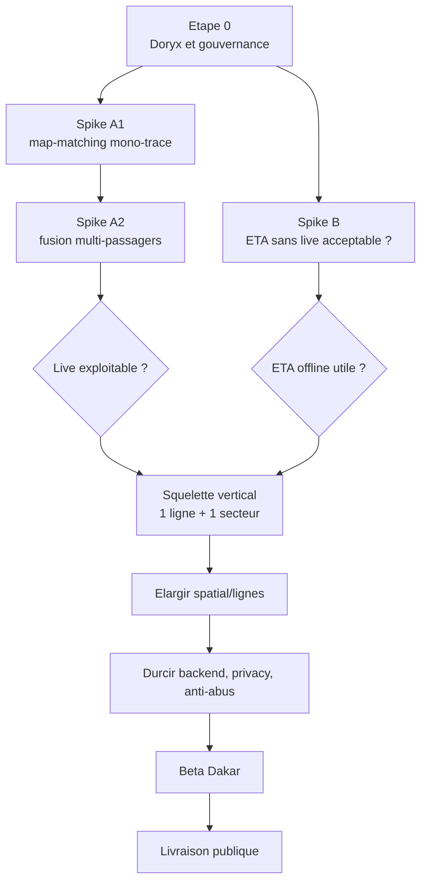

# Xetu - sequence d'execution risk-first

Date : 2026-06-25  
Doc parent : `C:\Users\DELL\Desktop\xetu-mobile\docs\xetu-master-delivery-plan.md`  
Doc spatial : `C:\Users\DELL\Desktop\xetu-mobile\docs\spatial-layer-reperes-plan.md`

Ce document ne remplace pas les deux plans existants. Il les re-ordonne.

Le master plan decrit la cible. Le plan spatial decrit la couche reperes. Ce document decrit l'ordre d'execution pour eviter de construire beaucoup avant de tester le pari le plus risque.

## Probleme structurel

Le plan maitre est bon comme carte de la cible, mais son ordre horizontal peut retarder le test le plus important :

```text
Est-ce que le GPS de passagers volontaires peut produire un bus_state fiable ?
```

Si cette reponse est non, Xetu doit pivoter vite vers un produit centre sur :

- recherche d'arrets ;
- reperes Dakar ;
- itineraire ;
- ETA horaire / estime ;
- signalements ponctuels.

Il ne faut pas decouvrir cette limite apres avoir construit toute la couche IA, notification et tracking complet.

## Sequence recommandee



## Etape 0 - Gouvernance Doryx

Avant les spikes, verifier l'etat Doryx du repo concerne.

Constat actuel cote mobile :

```text
C:\Users\DELL\Desktop\xetu-mobile\.doryx\state.json = DONE
```

Implication :

- le repo mobile ne doit pas demarrer un travail EXECUTE gouverne tant que l'etat n'est pas archive/reset ;
- les documents deja ecrits dans ce repo sont des consolidations documentaires ;
- avant toute implementation mobile, il faut ouvrir une nouvelle tache Doryx propre.

Constat actuel cote backend :

```text
C:\Users\DELL\Desktop\whatsapp-agent\.doryx\state.json = IDLE au moment de l'audit, puis PLAN pour le document backend.
```

Implication :

- le backend peut recevoir une nouvelle tache Doryx ;
- le plan backend doit vivre dans `whatsapp-agent`, car sessions, pings, `bus_state`, map-matching et ETA y seront implementes.

## Semaine 1-2 - Spikes avant le lourd

### Spike A1 - Map-matching mono-trace

Question :

```text
Une trace GPS passager seule peut-elle etre rattachee proprement a la trace Dem Dikk ?
```

Perimetre :

- une ligne : `232` ;
- un secteur : Liberte / Dieuppeul / Yoff / Sandaga ;
- une personne ;
- logger GPS du commerce ou export GPX/JSON ;
- zero changement mobile/backend si possible ;
- pas encore de tables finales `tracking_sessions`.

A mesurer :

- erreur de projection sur trace Dem Dikk ;
- stabilite de la progression sur trace ;
- detection du sens ;
- bruit GPS en rue dense ;
- temps entre pings.

Sorties :

```text
tracking_spike_a1_raw_trace.jsonl
tracking_spike_a1_mapmatch_report.json
tracking_spike_a1_decision.md
```

Critere de passage :

- le bus map-matche majoritairement sur la bonne trace ;
- la progression ne saute pas n'importe comment.

Critere d'arret :

- si les pings sont trop bruites ou impossibles a rattacher a une trace, ne pas promettre le live MVP ;
- basculer le MVP vers ETA offline + signalement ponctuel + spatial resolver.

### Spike A2 - Fusion multi-passagers

Question :

```text
Deux contributeurs simultanes dans le meme bus peuvent-ils produire un bus_state agrege utile ?
```

Perimetre :

- meme ligne `232` ;
- meme secteur ;
- au moins 2 personnes dans le meme bus au meme moment ;
- recrutement explicite avant le test ;
- pas de validation de live communautaire sans ce test.

A mesurer :

- concordance entre traces ;
- naissance/fusion/mort d'un `vehicle_id` temporaire ;
- ecart entre contributeurs ;
- effet des pings manquants ;
- score de confiance possible.

Sorties :

```text
tracking_spike_a2_multi_trace.jsonl
tracking_spike_a2_fusion_report.json
tracking_spike_a2_decision.md
```

Critere de passage :

- l'etat agrege peut dire "bus probablement ici" avec une confiance honnete ;
- la fusion ne cree pas deux bus fantomes pour un seul vehicule ;
- la perte d'un contributeur ne casse pas immediatement l'etat.

Critere d'arret :

- si la fusion multi-passagers est trop instable, garder le live comme bonus opportuniste ;
- ne pas en faire la promesse principale du MVP.

### Spike B - ETA sans live

Question :

```text
Si personne ne tracke le bus, l'ETA estime reste-t-il utile ?
```

Perimetre :

- 5 trajets reels chronometres ;
- ligne prioritaire `232`, puis une deuxieme ligne si possible ;
- comparer calcul theorique vs temps reel.

Baseline recommandee :

- distance sur `geometry_aller` / `geometry_retour` ;
- vitesse bus par tranche `06-09`, `09-16`, `16-20` ;
- dwell time par arret.

Point OSM/Valhalla clarifie :

- OSM self-host/Valhalla peut servir de diagnostic ou de baseline secondaire ;
- il ne doit pas remplacer la trace Dem Dikk comme chemin primaire ;
- ne pas utiliser un itineraire voiture point-a-point qui invente un chemin different de la ligne.

Sorties :

```text
eta_spike_field_runs.jsonl
eta_spike_accuracy_report.json
eta_spike_decision.md
```

Critere de passage :

- l'ETA offline donne une fourchette assez utile pour l'utilisateur ;
- l'erreur est explicable par tranche horaire, congestion ou dwell.

Critere d'arret :

- si l'ETA offline est trop fausse, ne pas la presenter comme prediction ;
- afficher plutot des durees indicatives avec confiance basse jusqu'aux donnees live.

## Ensuite - Squelette vertical MVP

Objectif :

```text
"Je suis devant la police Dieuppeul, je vais a Sandaga"
-> resolver
-> arret depart
-> ligne/sens
-> ETA
-> notification avant descente
```

Perimetre volontairement petit :

- ligne `232` ;
- secteur Liberte / Dieuppeul / Yoff / Sandaga ;
- quelques reperes valides seulement ;
- tracking live si A1 et A2 passent ;
- ETA offline si le live ne passe pas.

Ce squelette est le vrai MVP technique, parce qu'il traverse toutes les couches utiles :

- spatial ;
- GPS utilisateur ;
- route ;
- ETA ;
- carte ;
- chat ;
- notification ;
- confiance.

## Ensuite - Elargir

Quand le squelette marche :

- ajouter les reperes du fichier `spatial_landmark_candidates.review.jsonl` par priorite ;
- valider les liens reperes -> arrets ;
- ajouter d'autres lignes MVP ;
- couvrir Plateau, UCAD/Fann, Yoff, Parcelles, Ouakam/Mamelles, Liberte/Dieuppeul.

Regle :

- on elargit uniquement sur des rails deja prouves par le squelette vertical.

## Ensuite - Durcir

A faire apres validation de valeur :

- contrats backend definitifs ;
- tables `tracking_sessions`, `tracking_pings`, `bus_state` ;
- anti-abus ;
- retention ;
- consentement ;
- background location ;
- notification robuste ;
- monitoring ;
- store readiness.

## Slice contract-first cross-repo

Avant que le mobile code contre le live final, figer le contrat dans le backend `whatsapp-agent`.

Endpoints cible :

```text
POST /tracking/session/start
POST /tracking/session/ping
POST /tracking/session/stop
GET  /api/buses
GET  /api/eta
```

Contrats a definir :

- schema `bus_state` ;
- schema `eta_response` ;
- niveaux de confiance ;
- erreurs et statuts ;
- TTL et expiration ;
- format de `vehicle_id` temporaire ;
- comportement apres 20h.

Regle AGENTS :

- le mobile consomme le contrat backend reel ;
- si le PRD et le backend divergent, inspecter le backend et corriger le PRD avant implementation mobile.

## Consentement et background location tot

Ce sujet ne doit pas attendre la fin.

Questions a trancher avant beta :

- MVP foreground-only ou background location ?
- combien de temps une session peut rester active ?
- comment expliquer la valeur au passager ?
- comment arreter automatiquement ?
- comment limiter batterie/data ?
- quelles permissions Android/iOS sont necessaires ?
- quelles phrases store/privacy utiliser ?

Decision MVP recommandee :

- commencer foreground tracking ;
- demander background seulement si les tests terrain prouvent que foreground ne suffit pas ;
- ne pas promettre le live permanent avant validation store/privacy.

## Validation spatiale a nommer

La revue des 166 reperes ne doit pas rester abstraite.

Methode recommandee :

- prioriser 50 reperes ;
- produire top 3 arrets proches par repere ;
- valider par GPS, terrain, ou connaissance locale explicite ;
- marquer `validated`, `rejected`, ou `needs_more_info` ;
- ne pas calibrer les seuils de confiance avant les sorties A1/A2.

## Ordre de travail remplace

Ordre risk-first :

1. Etape 0 Doryx : ouvrir une tache propre dans le repo concerne.
2. Spike A1 map-matching mono-trace ligne `232`.
3. Spike A2 fusion multi-passagers ligne `232`.
4. Spike B ETA offline sur trajets reels.
5. Decision live MVP : live communautaire, ETA offline, ou hybride.
6. Squelette vertical `Police Dieuppeul -> Sandaga`.
7. Contrat backend minimal pour ce squelette.
8. UX mobile minimale pour ce squelette.
9. Couche spatiale prioritaire sur le secteur choisi.
10. Carte + chat + notification sur ce secteur.
11. Elargissement lignes/reperes.
12. Durcissement privacy/anti-abus/background.
13. Beta Dakar.
14. Livraison publique.

## Decision a prendre apres les spikes

### Cas 1 - Tracking live passe

Produit MVP :

- spatial resolver ;
- tracking passager foreground ;
- bus_state live avec confiance ;
- ETA hybride live + offline ;
- notification avant descente.

### Cas 2 - Tracking live faible mais utilisable

Produit MVP :

- spatial resolver ;
- ETA offline par defaut ;
- live seulement quand confiance suffisante ;
- signalements ponctuels ;
- transparence forte sur la confiance.

### Cas 3 - Tracking live echoue

Produit MVP :

- spatial resolver ;
- recherche arrets/lignes ;
- ETA indicatif ;
- signalement ponctuel ;
- pas de promesse bus live.

Ce cas n'est pas un echec produit. C'est une decision honnete avant de depenser trop.
