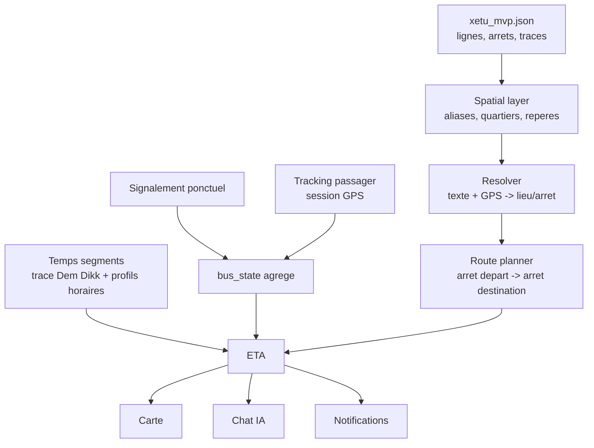

# Xetu - plan maitre produit, tracking, IA et livraison

Date : 2026-06-25  
Repo mobile : `C:\Users\DELL\Desktop\xetu-mobile`  
Repo backend / source metier : `C:\Users\DELL\Desktop\whatsapp-agent`  
Source de verite lignes/arrets/traces : `C:\Users\DELL\Desktop\whatsapp-agent\Dashboard\data\xetu_mvp.json`

Ce document fusionne les plans :

- carte et UI mobile ;
- couche spatiale Dakar ;
- agent IA ;
- tracking passagers ;
- ETA ;
- notifications ;
- backend ;
- livraison Android/iOS.

L'objectif final n'est pas seulement "voir une carte". L'objectif est que Xetu devienne une app qui comprend comment les gens parlent a Dakar, trouve le bon arret, suit les bus via les passagers, estime les arrivees et aide l'utilisateur jusqu'a destination.

## Vision finale

Xetu doit permettre a une personne de dire :

```text
Je suis devant la police Dieuppeul, je vais a Sandaga.
```

Et recevoir :

```text
Tu es probablement vers Police de Dieuppeul. L'arret le plus utile est
Sapeur Pompier Dieuppeul. Pour Sandaga, prends la ligne 232 vers Plateau.
Je peux suivre ton trajet et te prevenir avant la descente.
```

Puis, si des passagers partagent leur GPS :

```text
Le bus 232 le plus proche est estime a 7 min.
Confiance : moyenne, 2 contributeurs actifs.
```

## Architecture cible



## Principes non negociables

- `xetu_mvp.json` reste la source de verite pour lignes, arrets, coordonnees et traces.
- Gemini/Maps sert a decouvrir des candidats, pas a ecrire directement la verite.
- Les traces Dem Dikk sont prioritaires sur le routage voiture.
- Le tracking passager et le signalement ponctuel sont deux ingestions separees.
- Le produit expose une seule verite agregee : `bus_state`.
- Apres 20h, les lignes urbaines MVP affichent un etat de service termine, sauf horaire specifique valide.
- Aucun ping GPS brut ne doit etre expose comme bus live sans agregation et score de confiance.
- La PWA actuelle peut rester dans Expo au debut, mais le pont natif doit devenir reellement utilise.

## Phase 0 - Stabiliser la base actuelle

But : arreter les incoherences visibles et avoir un MVP propre avant le live.

### Slice 0.1 - Corriger les lignes affichees

Probleme : la modale affiche des lignes non cartographiees comme `15`, `26`, `DDD`, `Tata`, `BRT`, etc.

A faire :

- brancher la liste UI sur les lignes MVP reelles ;
- afficher seulement `1, 4, 6, 7, 8, 9, 10, 13, 23, 232` pour les fonctions cartographiees ;
- si d'autres lignes sont marketing/futures, les separer clairement.

Definition de termine :

- l'utilisateur ne peut plus s'abonner a une ligne absente de la carte MVP.

### Slice 0.2 - Reparer le theme light et la bottom nav

A faire :

- revoir les tokens light/dark ;
- corriger les contrastes ;
- ajouter safe-area bas ;
- refaire la bottom nav flottante avec bouton central `Signaler`.

Definition de termine :

- theme light coherent sur l'ecran signalement ;
- pas de collision avec Android navigation / iOS home indicator ;
- bottom nav stable sur petit ecran.

### Slice 0.3 - Prouver le pont natif geoloc

A faire :

- connecter la PWA a `window.XetuNative.requestLocation(requestId)` ;
- remplacer les appels directs fragiles a `navigator.geolocation` dans le shell mobile ;
- renvoyer `locationResult` a la PWA ;
- poster un signalement vers `/tracking/update`.

Definition de termine :

```text
App mobile -> pont natif Expo -> GPS -> /tracking/update -> /api/buses -> carte
```

## Phase 1 - Couche spatiale Dakar

But : comprendre les lieux comme les utilisateurs les nomment.

### Slice 1.1 - Inventaire des donnees

A faire :

- produire un rapport depuis `xetu_mvp.json` ;
- compter arrets, aliases, hubs, quartiers ;
- identifier les zones pauvres.

Sortie :

```text
spatial_inventory.report.json
```

### Slice 1.2 - Nettoyer les candidats existants

Fichiers de travail deja produits :

```text
C:\Users\DELL\Desktop\xetu-mobile\spatial_candidates.gemini.all.jsonl
C:\Users\DELL\Desktop\xetu-mobile\spatial_landmark_candidates.review.jsonl
```

A faire :

- dedupliquer ;
- normaliser accents/casse ;
- regrouper les variantes ;
- garder `source`, `status`, `confidence`.

Definition de termine :

- aucun candidat Gemini ne passe en `validated` automatiquement.

### Slice 1.3 - Lier reperes et arrets

A faire :

- relier `Police Dieuppeul`, `ESTG Dakar`, `Renaissance`, `Sandaga`, `Liberte 6`, etc. aux arrets proches ;
- produire top 3 arrets par repere ;
- scorer par distance GPS, zone et texte.

Sortie :

```text
spatial_landmark_stop_links.review.jsonl
```

### Slice 1.4 - Revue humaine priorisee

Priorite 1 :

- Sandaga ;
- Plateau ;
- UCAD/Fann ;
- Yoff ;
- Liberte 4/5/6 ;
- Dieuppeul/Derke ;
- Parcelles ;
- Monument Renaissance / Mamelles / Ouakam ;
- grands marches, hopitaux, stades, commissariats.

Sortie :

```text
spatial_landmark_stop_links.validated.jsonl
```

### Slice 1.5 - Canoniser proprement

Option recommandee :

```text
xetu_mvp.json             = lignes, arrets, traces
xetu_spatial_layer.json   = reperes, aliases, zones, liens vers arrets
```

Pourquoi :

- le MVP JSON reste stable ;
- la couche des reperes peut evoluer vite ;
- les validations restent tracables.

## Phase 2 - Resolver local et agent IA

But : transformer une phrase utilisateur en arrets et lignes possibles.

### Slice 2.1 - Resolver deterministe

Entrees :

- texte utilisateur ;
- GPS utilisateur ;
- ligne citee si presente ;
- contexte conversationnel.

Sortie :

```json
{
  "from": "Police de Dieuppeul",
  "from_stop_candidates": [],
  "to": "Sandaga",
  "to_stop_candidates": [],
  "candidate_lines": ["232"],
  "needs_clarification": false
}
```

A faire :

- recherche fuzzy locale ;
- filtre GPS ;
- filtre par ligne ;
- clarification courte si ambigu.

### Slice 2.2 - Chat IA controle

Regle : l'IA parle, mais le resolver decide.

A faire :

- l'IA reformule ;
- l'IA pose les questions ;
- l'IA ne choisit pas un arret invente ;
- toute reponse transport doit venir des donnees Xetu.

### Slice 2.3 - Cas conversationnels MVP

Cas a couvrir :

- "Je suis a Liberte 6, je vais a Yoff."
- "Je suis devant la police Dieuppeul."
- "Je vais a Sandaga."
- "Quelle ligne pour Yoff ?"
- "Je suis dans le bus 232."
- "Previens-moi avant mon arret."

## Phase 3 - Temps entre arrets et ETA offline

But : avoir des temps utiles meme sans tracking live.

### Slice 3.1 - Distance sur trace Dem Dikk

A faire :

- utiliser `geometry_aller` / `geometry_retour` ;
- calculer distance arret -> arret sur la trace ;
- ne pas utiliser OSRM/osmnx voiture comme source primaire.

### Slice 3.2 - Profils horaires

Tranches MVP :

```text
06-09  pointe matin
09-16  creux journee
16-20  pointe soir
```

A faire :

- vitesse bus par tranche ;
- dwell time par arret ;
- `travel_time_to_next_sec` = valeur journee type ;
- `travel_time_profiles` = profils complets.

Regle :

- pas d'ETA normal apres 20h pour les lignes urbaines MVP.

### Slice 3.3 - Confiance ETA

Niveaux :

- haute : bus live corrobore + map-match bon ;
- moyenne : bus live unique ou signalement recent ;
- basse : estimation horaire sans live ;
- indisponible : service termine ou donnees insuffisantes.

## Phase 4 - Tracking passager live

But : passer du signalement ponctuel au vrai suivi par passagers dans le bus.

### Slice 4.1 - Deux ingestions, une verite

Garder :

```text
/tracking/update
```

Pour :

- signalements ponctuels ;
- WhatsApp/PWA sparse ;
- compatibilite actuelle.

Ajouter :

```text
POST /tracking/session/start
POST /tracking/session/ping
POST /tracking/session/stop
```

Pour :

- passager qui accepte de suivre le bus ;
- pings continus ;
- session avec consentement.

### Slice 4.2 - Tables cible

Tables proposees :

```text
tracking_sessions
tracking_pings
bus_state
```

`bus_state` est la seule verite exposee au produit.

### Slice 4.3 - Map-matching sur trace

A faire :

- projeter chaque ping sur la trace de la ligne ;
- calculer progression ;
- verifier direction ;
- detecter si l'utilisateur n'est plus dans le bus ;
- ignorer ou declasser les pings incoherents.

### Slice 4.4 - Agregation multi-passagers

A faire :

- grouper les pings compatibles ;
- creer un `vehicle_id` temporaire ;
- fusionner les contributeurs proches ;
- donner un score de confiance ;
- expirer les bus inactifs.

### Slice 4.5 - Batterie et data

Regles :

- ping lent quand bus immobile ;
- ping plus rapide proche d'un arret ou d'une destination ;
- stop automatique si l'utilisateur quitte la ligne ;
- pause quand batterie faible.

## Phase 5 - Carte live et experience trajet

But : rendre la valeur visible.

### Slice 5.1 - Carte MVP

Decision actuelle :

- garder Leaflet/PWA pour MVP ;
- ne pas migrer a `react-native-maps` maintenant ;
- garder MapLibre comme option future si la carte live devient trop limitee.

A faire :

- afficher arrets ;
- afficher traces ;
- afficher bus live / estime avec distinction visuelle ;
- afficher niveau de confiance.

### Slice 5.2 - Experience "je suis dans le bus"

A faire :

- bouton demarrer tracking ;
- consentement clair ;
- ligne et direction detectees/confirmees ;
- compteur contribution ;
- bouton stop ;
- feedback : "tu aides les autres passagers".

### Slice 5.3 - Experience "je cherche mon trajet"

A faire :

- depart par GPS + repere ;
- destination par texte ;
- ligne recommandee ;
- arret de depart ;
- arret de descente ;
- ETA et confiance.

## Phase 6 - Notifications

But : aider sans obliger l'utilisateur a garder l'app ouverte.

### Slice 6.1 - Notification avant descente

A faire :

- demander destination ;
- calculer progression sur trace ;
- notifier avant l'arret cible ;
- gerer perte GPS / tracking stoppe.

### Slice 6.2 - Notification bus proche

A faire :

- abonnement a une ligne ou un arret ;
- envoyer notification si bus approche ;
- respecter service `06h-20h`.

### Slice 6.3 - Permissions

A faire :

- documenter permissions Android/iOS ;
- expliquer background location ;
- ne pas demander background trop tot si MVP foreground suffit.

## Phase 7 - Anti-abus, privacy et confiance

But : ne pas fabriquer de faux bus et ne pas trahir les utilisateurs.

### Slice 7.1 - Identite anonyme

Recommandation MVP :

- `device_id` anonyme ;
- pas besoin de compte au debut ;
- token de session signe pour tracking.

### Slice 7.2 - Anti-fraude

A faire :

- rate-limit ;
- score bas pour source unique ;
- corroboration multi-passagers ;
- detection vitesse impossible ;
- detection hors trace ;
- expiration rapide.

### Slice 7.3 - Retention

Regle :

- garder les pings bruts peu longtemps ;
- garder seulement agregats utiles ;
- supprimer/anonymiser apres fenetre courte.

## Phase 8 - Observabilite et apprentissage

But : ameliorer Xetu avec les vrais usages.

Metriques produit :

- requetes non resolues ;
- lieux ambigus ;
- corrections utilisateur ;
- sessions tracking demarrees ;
- sessions terminees proprement ;
- pings rejetes ;
- ETA error quand observable ;
- notifications utiles.

Files de correction :

```text
unresolved_places.jsonl
spatial_corrections_queue.jsonl
tracking_quality_report.json
eta_accuracy_report.json
```

## Phase 9 - Migration mobile progressive

But : sortir du simple shell WebView seulement quand la valeur le justifie.

### Option court terme

- Expo shell + PWA ;
- pont natif geoloc ;
- push notifications ;
- eventuellement background location.

### Option moyen terme

- garder carte PWA si elle marche ;
- native-iser les ecrans sensibles : permissions, tracking actif, notifications, onboarding.

### Option long terme

- app Expo plus native ;
- carte MapLibre/react-native si besoin ;
- PWA reste utile pour web/desktop.

Decision :

- ne pas migrer toute l'UI avant d'avoir prouve tracking + ETA + resolver.

## Phase 10 - Livraison MVP

But : sortir une version utile et testable.

### MVP livrable

Inclus :

- vraies lignes MVP ;
- carte propre ;
- theme light/dark correct ;
- recherche ligne/arret ;
- couche spatiale validee sur zones prioritaires ;
- signalement ponctuel fonctionnel ;
- tracking passager foreground ;
- bus_state agrege ;
- ETA avec confiance ;
- notifications simples ;
- consentement GPS clair.

Exclu du premier livrable :

- tracking background permanent ;
- toutes les lignes Dem Dikk ;
- temps reel parfait ;
- compte utilisateur complet ;
- paiement/recompenses complexes.

### Verification avant livraison

Mobile :

- `npx.cmd tsc --noEmit` ;
- `npx.cmd expo config --type public` ;
- test Android emulator ;
- test permissions GPS ;
- test notification si ajoutee.

Backend :

- tests endpoint tracking ;
- tests resolver ;
- tests map-matching ;
- tests ETA ;
- test expiration bus_state.

Terrain :

- 5 trajets reels minimum ;
- 3 zones : Plateau, Liberte/Dieuppeul, Yoff ;
- verifier ETA et arrets proposes ;
- noter corrections.

## Phase 11 - Beta Dakar

But : apprendre avec un petit groupe.

A faire :

- beta fermee Android ;
- 20 a 50 testeurs ;
- focus lignes `232`, `8`, `6`, `7` selon usage ;
- collecter lieux non compris ;
- collecter erreurs ETA ;
- ajuster aliases et liens reperes -> arrets.

Critere de passage :

- l'utilisateur trouve une ligne utile sans connaitre le nom exact de l'arret ;
- au moins quelques sessions tracking produisent un bus_state exploitable ;
- les ETA affichent une confiance honnete.

## Phase 12 - Livraison publique

But : publier sans promettre plus que le systeme ne sait faire.

A faire :

- store listing clair ;
- politique privacy ;
- mentions GPS et anonymisation ;
- screenshots propres ;
- analytics minimum ;
- crash reporting ;
- monitoring backend ;
- plan rollback.

Message produit :

```text
Xetu t'aide a trouver le bon bus a Dakar avec les arrets, les reperes du quartier
et les positions partagees par les passagers.
```

Ne pas promettre :

```text
Tous les bus en temps reel garanti.
```

Promettre plutot :

```text
Positions et ETA avec niveau de confiance.
```

## Ordre recommande de travail

Mise a jour : l'ordre d'execution doit etre risk-first, pas horizontal par couches.

Le plan maitre ci-dessus reste la cible produit. L'ordre de construction est decrit dans :

```text
C:\Users\DELL\Desktop\xetu-mobile\docs\xetu-execution-sequence.md
```

Resume de l'ordre remplace :

1. Spike A tracking brut ligne `232`.
2. Spike B ETA offline sur trajets reels.
3. Decision live MVP : live communautaire, ETA offline, ou hybride.
4. Squelette vertical `Police Dieuppeul -> Sandaga`.
5. Contrat backend minimal pour ce squelette.
6. UX mobile minimale pour ce squelette.
7. Couche spatiale prioritaire sur le secteur choisi.
8. Carte + chat + notification sur ce secteur.
9. Elargissement lignes/reperes.
10. Durcissement privacy/anti-abus/background.
11. Beta Dakar.
12. Livraison publique.

## Definition de la derniere forme

La derniere forme de Xetu n'est pas juste une app de carte. C'est un assistant de transport local :

- il comprend les noms officiels et les noms terrain ;
- il sait utiliser la position de l'utilisateur ;
- il trouve les arrets proches ;
- il recommande la ligne et le sens ;
- il suit les bus grace aux passagers volontaires ;
- il calcule un ETA avec confiance ;
- il previent avant la descente ;
- il apprend des corrections terrain ;
- il reste honnete quand il ne sait pas.

La carte est l'interface visible. La vraie valeur est la couche de verite locale + tracking communautaire + agent prudent.
